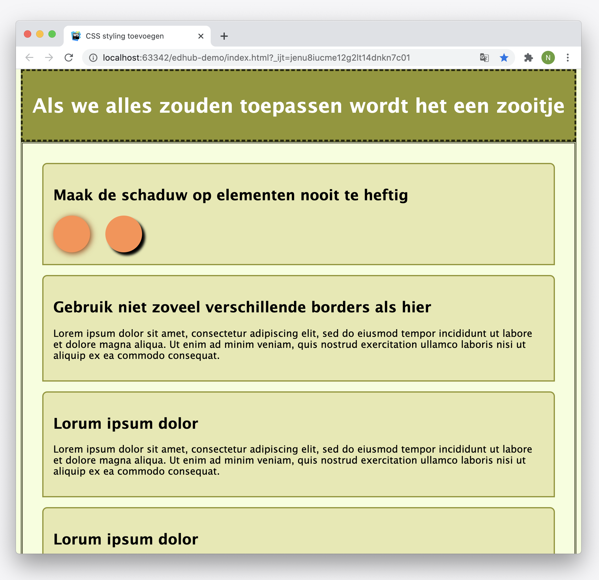

# Opdracht beschrijving

## Eindresultaat
Laten we eens gaan expirimenteren met borders, afmetingen en positionering! Het eindresultaat zal er zo uit komen te zien:

## Opdrachtbeschrijving
Zorg ervoor dat jouw pagina er precies zo uit komt te zien als de pagina in het voorbeeld. In het voorbeeld is het browser-window expres minder breed gemaakt en we raden jou aan hetzelfde te doen om ervoor te zorgen dat je kunt scrollen. Je mag **niets** veranderen in de aangeleverde HTML, behalve het toevoegen van `class` of `id`-attributen. Let hierbij op de volgende dingen:

* De cirkels maak je met de twee lege `<div`-tags die al aanwezig zijn in het eerste `<article>` element;
* Gebruik het standaard systeemfont "Lucida Grande", maar zorg dat je ook een aantal fallback-fonts declareert.
* Er is gebruik gemaakt van de volgende kleuren:
    * *hsl(63, 56%, 10%)* (donkergroen voor de randen).
    * *hsl(63, 56%, 38%)* (groen voor de header).
    * *hsl(23, 100%, 65%)* (oranje voor de cirkels).
    * *hsl(74, 95%, 93%)* (limoengroen voor de achtergrond).
    * De achtergrond-kleur voor de `articles` is een lichtere versie van de header-kleur. Dit kun jij op basis van hsl-kleuren gemakkelijk zelf aanpassen!

* Zorg dat de header bovenaan de pagina blijft staan wanneer je naar beneden scrolt.

Psssst: ben je benieuwd hoe je schaduwen achter elementen plaatst? Bekijk dan [dit artikel](https://developer.mozilla.org/en-US/docs/Web/CSS/box-shadow) op MDN Web Docs eens.

## Antwoorden
Dit is een EdHub opdracht om je te helpen oefenen met de stof. Ben je benieuwd of jouw implementatie klopt? De antwoorden staan in deze zelfde repository, op de branch [uitwerkingen](https://github.com/hogeschoolnovi/frontend-css-groen-artikel/blob/uitwerkingen/styles.css).